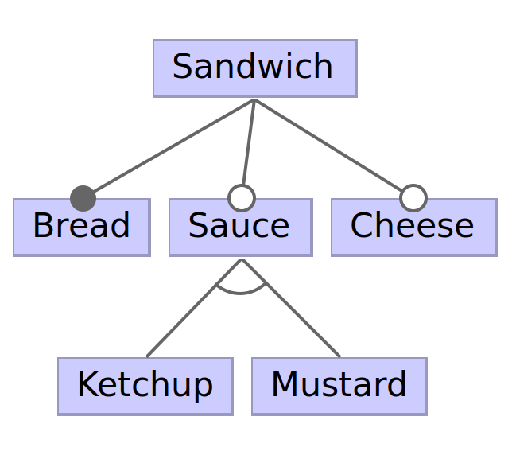

### Community-Driven Language for Variability Models

The **U**niversal **V**ariability **L**anguage is a community effort towards a unified language for variability models. UVL is a direct result of the efforts within the <a href="https://modevar.github.io/">MODEVAR</a> initiative. *Do you have any questions on UVL?* *Do you want to contribute?* *We gladly receive your message [(Contact)](mailto:chico.sundermann@uni-ulm.de).*

# Language Design

UVL specifies variability models with a tree-like structure to represent the hierarchical structure of variability models. Below you can see a simple example of a variability model in UVL. The tree structure is visualized on the right side in the [FeatureIDE](https://github.com/FeatureIDE/FeatureIDE) representation. The language core of UVL comes with several concepts to specify constraints:

* *Mandatory*: The feature needs to be selected if its parent is selected
* *Optional*: The feature can be selected if its parent is selected
* *Or*: At least one of the children need to be selected if its parent is selected
* *Alternative*: Exactly one of the children needs to be selected
* *Cross-tree constraints*: Arbitrary propositional constraints over the features 

<pre>
<code>
<b>features</b>
    Sandwich
        <b>mandatory</b>
            Bread
        <b>optional</b>
            Sauce
                <b>alternative</b>
                    Ketchup
                    Mustard
            Cheese
<b>constraints</b>
    Ketchup => Cheese
</code>
</pre>

## Language Levels

In addition to the language core described above, UVL provides several extensions providing additional language constructs. The following language levels are supported:

* SAT Level
    * SAT Core: Level without any extension as seen above
    * Group Cardinality: Specify selecting [n..m] (between n and m) children parent-children relationships D
* SMT Level
    * SMT Core: Supports constraints over feature attributes with standard arithmetic operations (+,-,*,/,=,!=,>,<)
    * Attribute aggregates: Simplifies specification of attribute constraints by allowing sum() and avg() aggregates
    * Feature Cardinality: A single feature can be selected between n and m times 

The following feature model in UVL syntax enriches the previous version with new language concepts. Further, feature attributes, such as the number of calories, are attached to features.

<pre>
<code>

<b>include
    SAT-level.group-cardinality
    SMT-level.aggregate-function
    SMT-level.feature-cardinality</b>

<b>features</b>
    Sandwich
        <b>mandatory</b>
            Bread {Calories 100, Sugar 20}
        <b>optional</b>
            Sauce
                <b>or</b>
                    Ketchup {Calories 40, Sugar 35}
                    Mustard {Calories 25, Sugar 5}
            Cheese
                <b>[0..2]</b> <i>// Group cardinality</i>
                    Cheddar {Calories 60}
                    Gouda {Calories 50}
                    Goat {Calories 35}
            Pickle <b>cardinality [1..3]</b> <i>// Feature cardinality</i>
                    
<b>constraints</b>
    Ketchup => Cheese
    Bread.Sugar + Ketchup.Sugar + Mustard.Sugar < 60 <i>// Attribute constraints</i>
    sum(Calories) < 160 <i>// Attribute aggregate</i>
</code>
</pre>

# Software
Any tool support for UVL or tool integrating UVL missing? We are happy to embed your suggestion. [Contact us!](mailto:chico.sundermann@uni-ulm.de)

### Tool Support for UVL
* Java-based parser for UVL: <a href="https://github.com/Universal-Variability-Language/uvl-parser2.0">UVL-Parser2.0</a>
* Python-based parser for UVL (WIP): [UVL Parser](https://github.com/flamapy/uvlparser) 
* Rust-based Language Server Protocol for integrating UVL in your favorite IDE:  <a href="https://github.com/Universal-Variability-Language/uvl-lsp">UVLS</a> 
* Visual Studio Code <a href="https://marketplace.visualstudio.com/items?itemName=caradhras.uvls-code">extension </a> based on **UVLS**

### Tools Integrating UVL

* IDE for feature-oriented software development: <a href="https://github.com/FeatureIDE/FeatureIDE">FeatureIDE</a>
* Python-based analysis frame for variability models: [Flama](https://github.com/flamapy/)
* Transformations between different variability modelling approaches: [TraVarT](https://github.com/SECPS/TraVarT)

# Publications
Here, we only present a small selection of papers. Any interesting work on UVL missing? We are happy to embed your suggestion. [Contact us!](mailto:chico.sundermann@uni-ulm.de)

### Work on UVL

* Chico Sundermann, Kevin Feichtinger, Dominik Engelhardt, Rick Rabiser, and Thomas Thüm. 2021. Yet another textual variability language? a community effort towards a unified language. SPLC '21. <https://doi.org/10.1145/3461001.3471145>
* Chico Sundermann, Tobias Heß, Dominik Engelhardt, Rahel Arens, Johannes Herschel, Kevin Jedelhauser, Benedikt Jutz, Sebastian Krieter, and Ina Schaefer. 2021. Integration of UVL in FeatureIDE. MODEVAR@SPLC '21. <https://doi.org/10.1145/3461002.3473940>
* Kevin Feichtinger, Johann Stöbich, Dario Romano, and Rick Rabiser. 2021. TRAVART: An Approach for Transforming Variability Models. VaMoS '21. <https://doi.org/10.1145/3442391.3442400>
* Dario Romano, Kevin Feichtinger, Danilo Beuche, Uwe Ryssel, and Rick Rabiser. 2022. Bridging the gap between academia and industry: transforming the universal variability language to pure::variants and back. MODEVAR@SPLC '22. <https://doi.org/10.1145/3503229.3547056>
* Jose M. Horcas, Jose A. Galindo, Mónica Pinto, Lidia Fuentes, and David Benavides. 2022. FM fact label: a configurable and interactive visualization of feature model characterizations. SPLC '22. <https://doi.org/10.1145/3503229.3547025>
* David Romero, José Á. Galindo, Jose-Miguel Horcas, and David Benavides. 2021. A first prototype of a new repository for feature model exchange and knowledge sharing. SPLC '21. <https://doi.org/10.1145/3461002.3473949>

### Work Relevant for the Design of UVL
* Maurice H. ter Beek, Klaus Schmid, and Holger Eichelberger. 2019. Textual Variability Modeling Languages: An Overview and Considerations. MODEVAR@SPLC '19. <https://doi.org/10.1145/3307630.3342398>
* Thorsten Berger and Philippe Collet. 2019. Usage Scenarios for a Common Feature Modeling Language. MODEVAR@SPLC '19. <https://doi.org/10.1145/3307630.3342403>
* Thomas Thüm, Christoph Seidl, and Ina Schaefer. 2019. On Language Levels for Feature Modeling Notations. MODEVAR@SPLC '19 <https://doi.org/10.1145/3307630.3342404>

  